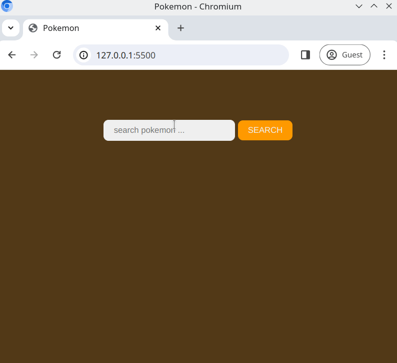

# Pokemon Cards

**Pokemon Cards** is a search application where users can search for information about Pokémon using the [Pokemon API](https://pokeapi.co/). This project demonstrates the use of the Fetch API to make API requests and dynamic DOM manipulation to display results.

## Features
- **Search Functionality**: Users can input Pokémon names and search for corresponding details.
- **Validation**: 
  - Checks to ensure the input field is not empty.
  - Displays a warning to the user if the input is empty.
- **Dynamic Display**: The results are shown in a stylized card that includes:
  - **Name** of the Pokémon
  - **Image** (front_default sprite)
  - **Stats** (e.g., HP, Attack, Defense, etc.)
  - **Abilities**

## Technologies
- **Fetch API**: For fetching data from the Pokemon API.
- **HTML5 and CSS**: For the page structure and design.
- **JavaScript**: For handling the API requests and DOM manipulation.

## Requirements
1. **Search Field and Button**:  
   - An `<input />` field for the Pokémon name.  
   - A `<button>` to trigger the search.
2. **Validation**:  
   - Ensure the input field is not empty.  
   - Display a warning if the input field is empty.
3. **API Call**:  
   - Use the Fetch API to retrieve data from the [Pokemon API](https://pokeapi.co/) based on the user's input.
4. **Displaying Results**:  
   - Display the search results dynamically on the page.  
   - The Pokémon card should contain:
     - The name of the Pokémon
     - An image (front_default sprite)
     - Stats such as HP, Attack, Defense, etc.
     - A list of abilities.

## Example View
Here is a preview of how the final result might look:  



## Getting Started
1. Clone the repository to your local machine:
   ```bash
   git clone <repository-url>
  